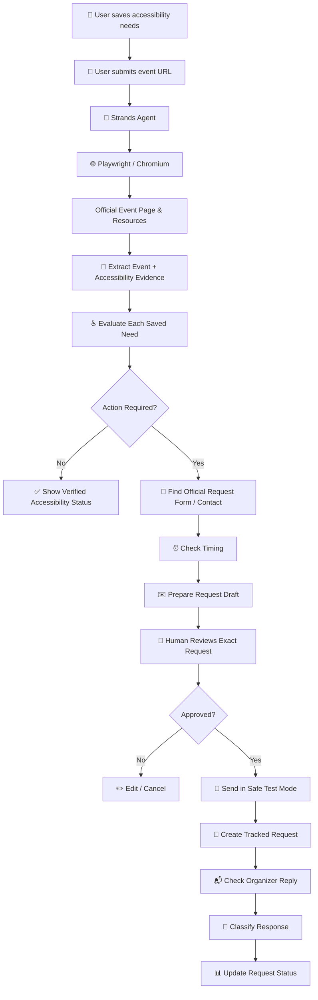
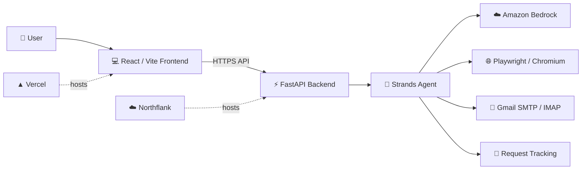

# ♿ Accessly

<p align="center">
  <strong>Tell Accessly your accessibility needs once — it coordinates the rest for every event.</strong>
</p>

<p align="center">
  <a href="https://accessly-murex.vercel.app/">
    
  </a>
  <a href="https://github.com/ghaida-alsalamah/accessly">
    
  </a>
  
  
  
  
</p>

---

## 🌍 What is Accessly?

**Accessly is an AI accessibility coordination agent for events.**

People who need accessibility accommodations often repeat the same process for every conference, workshop, seminar, university event, or community activity:

- Search for accessibility information
- Find the correct contact person or form
- Explain their needs again
- Check accommodation request deadlines
- Submit a request
- Follow up
- Wait for confirmation

Accessly turns that repetitive process into one coordinated workflow.

> **Tell it your accessibility needs once. For every event after that, it handles the accessibility coordination for you.**

### 🚀 Live Demo

👉 **[Try Accessly](https://accessly-murex.vercel.app/)**

---

## 💡 The Problem

Accessibility information for events is often:

- Scattered across multiple pages
- Hidden behind forms
- Described using inconsistent wording
- Incomplete
- Or only available after contacting an organizer

Even when an accommodation is available, the attendee may still need to manually coordinate it.

A user may need:

- ASL interpretation
- Live captions
- Accessible parking
- Wheelchair access
- Accessible seating
- Assistive listening
- Large-print materials
- Screen-reader-friendly materials
- Quiet or sensory-friendly space

For every new event, they may need to repeat the same process.

**Accessly reduces that friction.**

---

# ✨ How Accessly Works

## 👤 1. Save Accessibility Needs

Users create a reusable accessibility profile.

No diagnosis is required.

Users can select common accessibility needs or enter a custom need.

---

## 🔗 2. Paste an Event URL

The user provides the official event page.

Accessly begins investigating the event automatically.

---

## 🌐 3. Browse the Real Event Website

Accessly uses **Playwright + Chromium** to inspect:

- The event page
- Accessibility information
- Linked accessibility pages
- Official forms
- Organizer information
- Request instructions

This allows Accessly to interact with real websites instead of relying only on static HTTP requests.

---

## 🔎 4. Extract Event Details

Accessly verifies:

- Event name
- Date
- Time
- Location
- Organizer
- Event format

These details are returned to the frontend and displayed as structured UI cards.

---

## ♿ 5. Evaluate Each Accessibility Need

Each saved need receives one of four statuses:

| Status | Meaning |
|---|---|
| ✅ **Confirmed** | Official evidence explicitly confirms the accommodation |
| ❌ **Not Confirmed** | The need applies, but no confirmation was found |
| ➖ **Not Applicable** | The accommodation clearly does not apply to the event format |
| ❓ **Unknown** | Accessly cannot reliably verify the information |

Accessly never assumes that an accessibility feature exists without official evidence.

---

## 📝 6. Find the Official Request Path

If an accommodation is not already confirmed, Accessly searches for the official method to request it.

This may include:

- Accessibility request form
- Organizer email
- Disability/accessibility office
- Official support contact
- Event registration instructions

---

## ⏰ 7. Check Request Timing

Accessly distinguishes between:

- A **preferred notice period**
- A **hard deadline**

Date calculations are handled programmatically rather than guessed by the language model.

---

## ✉️ 8. Prepare the Request

Accessly creates a structured accommodation request containing:

- Recipient
- Subject
- Message body
- Relevant event information
- Only applicable accessibility needs

The user sees the exact request before anything is sent.

---

## ✅ 9. Human Approval Before Action

Accessly uses a **human-in-the-loop workflow**.

Nothing is sent until the user explicitly approves the exact:

```text
Recipient
Subject
Message Body
```

---

## 📨 10. Safe Test Mode

During development, emails are redirected to a controlled test inbox.

This allows the complete workflow to be demonstrated without accidentally contacting real event organizers.

---

## 📊 11. Track the Request

After a successful request, Accessly creates a tracking record such as:

```text
REQ-001
```

The user can view:

- Event
- Overall request status
- Individual accommodation statuses
- Request history
- Updates

---

## 🔄 12. Check Organizer Replies

Accessly can check the inbox for a matching reply.

The agent interprets the response and updates the request.

Example:

```text
ASL interpretation  → CONFIRMED
Accessible parking  → NOT APPLICABLE
Overall request     → CONFIRMED
```

---

# 🧠 Agent Workflow



---

# 🛠️ Tech Stack

<p align="center">
  
  
  
  
  
  
  
  
  
  
  
  
</p>

| Technology | Role in Accessly |
|---|---|
| **Python 3.11** | Core backend and agent logic |
| **Strands Agents SDK** | Agent orchestration and tool usage |
| **Amazon Bedrock** | Managed foundation model access |
| **Claude Sonnet** | Reasoning, event analysis, drafting, and reply classification |
| **FastAPI** | API connecting the frontend to the agent |
| **Playwright / Chromium** | Real browser automation |
| **React + Vite** | User interface |
| **Docker** | Reproducible backend runtime |
| **Vercel** | Public frontend deployment |
| **Northflank** | Containerized backend deployment |
| **Gmail SMTP** | Test-mode email sending |
| **Gmail IMAP** | Reply checking |
| **GitHub** | Source control and deployment integration |

---

# 🏗️ Architecture



---

## 🌐 Deployment Architecture

```text
User
 │
 ▼
Accessly Frontend
Vercel
 │
 │ HTTPS API
 ▼
FastAPI Backend
Northflank
 │
 ▼
Strands Agent
 │
 ├── Amazon Bedrock
 ├── Playwright / Chromium
 ├── Gmail SMTP / IMAP
 └── Request Tracking
```

---

# 🧩 Core Agent Tools

## `get_user_accessibility_needs`

Reads the user's saved accessibility profile dynamically.

---

## `check_event_timing`

Calculates:

- Event date
- Days until event
- Preferred notice date
- Whether the preferred notice period has passed

---

## Browser Tool

Uses Chromium to inspect:

- Event pages
- Accessibility information
- Linked resources
- Forms
- Organizer pages

---

## `send_accommodation_email`

Sends an explicitly approved accommodation request.

During development, it operates in **Test Mode**.

---

## `create_request_record`

Creates a tracked request after successful sending.

Example:

```text
REQ-001
```

---

## `check_organizer_reply`

Checks the inbox for a reply associated with a tracked request.

---

## `update_request_status`

Updates:

- Overall request status
- Individual accessibility accommodation statuses

---

# 🛡️ Safety by Design

Accessibility coordination may involve real organizations and personal information.

Accessly therefore follows strict safety rules.

## Accessly will not:

- Invent accessibility information
- Assume an accommodation exists
- Invent form fields
- Invent names, phone numbers, or diagnoses
- Expand the user's saved accessibility needs
- Send a request without approval
- Automatically retry a failed send
- Submit a real organization's form during development testing

---

## 👀 Human-in-the-Loop Approval

Before a request is sent, Accessly shows the exact:

```text
Recipient
Subject
Message Body
```

The user must explicitly approve it.

---

## 🧪 Real Form Test Safety

During development:

> Accessly may inspect or fill a real organization's accessibility form, but it never clicks the final Submit button.

Only an Accessly-controlled test form may be fully submitted during testing.

---

# 🎨 Frontend Experience

The frontend is intentionally designed to feel like a product rather than a raw chatbot.

Instead of showing one large LLM response, Accessly converts agent results into structured UI components.

---

## 📅 Event Details

Displays:

- Event Name
- Date
- Time
- Location
- Organizer
- Format

---

## ♿ Accessibility Check

Each accessibility need receives its own card containing:

- Need
- Status badge
- Supporting evidence

---

## 📝 Request Action

Displays:

- Official contact or form
- Notice information
- Recommended action

---

## ✉️ Email Draft

Displays:

- To
- Subject
- Message
- Edit
- Approve & Send

---

## 📊 My Requests

Displays:

- Request ID
- Event
- Overall status
- Individual accommodation statuses
- Check for Updates

---

# 🧪 Testing

Accessly was tested against real public university event pages.

Examples included:

- University of Michigan
- Syracuse University
- University of Washington
- Stanford University

Testing covered:

- Real event browsing
- Dynamic event extraction
- Accessibility evidence checking
- Virtual vs. in-person applicability
- Preferred notice periods
- Official accessibility forms
- Organizer contact discovery
- Email drafting
- Human approval
- Test-mode sending
- Request creation
- Reply checking
- Status updates

---

## 🐳 Production Container Smoke Test

The production backend container was tested inside Northflank using:

```bash
python container_smoke.py
```

Result:

```text
PASS: Strands/browser imports, FastAPI startup, /health, headless Chromium
```

This confirmed that:

- FastAPI starts successfully
- Strands browser dependencies load
- Chromium launches headlessly
- The health endpoint responds correctly

---

## 🌐 Public End-to-End Test

The deployed application was tested through the public Vercel frontend and Northflank backend.

Verified:

- Frontend loads
- Profile saves successfully
- FastAPI receives event requests
- Strands Agent runs
- Bedrock processes the event
- Event Details update dynamically
- Accessibility results render as structured cards
- Draft generation works
- Human approval works
- Test email sending works
- Request tracking works
- Check for Updates works
- No CORS or frontend JavaScript errors were detected during the tested flow

---

# 🧭 Development Process

## Phase 1 — Terminal Agent Prototype

The first version ran completely from the terminal.

The initial goal was to prove that an agent could:

1. Receive a real event URL
2. Browse the event
3. Understand saved accessibility needs
4. Find accessibility information
5. Locate an official request path
6. Draft a request
7. Require user approval

---

## Phase 2 — Real Browser Automation

Some event websites rejected simple HTTP requests or required interactive navigation.

Accessly therefore moved to a real Chromium browser using **Playwright**.

This allowed the agent to:

- Navigate dynamic pages
- Follow official links
- Inspect accessibility resources
- Open forms
- Extract real event information

---

## Phase 3 — Safe Email Workflow

Gmail SMTP was added for request delivery.

A dedicated **Test Mode** redirects development messages to a controlled inbox rather than the real organizer.

---

## Phase 4 — Request Tracking

The system gained:

- Request IDs
- Overall request status
- Per-accommodation status
- Inbox reply checking
- Automatic updates

---

## Phase 5 — Dynamic Accessibility Profiles

Accessibility needs were moved out of hardcoded agent logic.

The agent now reads the user's saved profile dynamically.

---

## Phase 6 — Product Frontend

The terminal-based prototype was connected to a **React/Vite frontend** through **FastAPI**.

Agent responses were transformed from raw text into structured UI cards.

---

## Phase 7 — Cloud Deployment

The final architecture separates the frontend and backend:

```text
Vercel Frontend
       ↓
Northflank FastAPI Backend
       ↓
Strands Agent
       ↓
Amazon Bedrock + Chromium + Gmail
```

The backend is packaged in Docker so Chromium and its Linux dependencies run consistently in production.

---

# 📁 Repository Structure

```text
accessly/
│
├── frontend/
│   └── React / Vite frontend
│
├── api.py
├── main.py
├── result_presenter.py
├── deployment_runtime.py
├── container_smoke.py
│
├── Dockerfile.northflank
├── .dockerignore
├── .gitignore
│
├── requirements-api.txt
├── requirements-production.txt
│
├── test_frontend_ux.py
├── test_live_frontend.py
├── test_northflank.py
├── test_public_send.py
├── test_result_presenter.py
│
├── .env.production.example
├── LICENSE
└── README.md
```

> ⚠️ Secret `.env` files, local profiles, logs, credentials, and runtime request data should never be committed.

---

# ⚙️ Local Setup

## Prerequisites

Make sure you have:

- Python 3.11+
- Node.js
- npm
- Git
- Amazon Bedrock access
- A Bedrock bearer token
- Gmail App Password for email testing

---

## 1. Clone the Repository

```bash
git clone https://github.com/ghaida-alsalamah/accessly.git
cd accessly
```

---

## 2. Create a Python Virtual Environment

```bash
python -m venv .venv
```

Windows:

```powershell
.venv\Scripts\Activate.ps1
```

---

## 3. Install Backend Dependencies

```bash
pip install -r requirements-production.txt
```

---

## 4. Create `.env`

Create a local file named:

```text
.env
```

Add:

```env
AWS_BEARER_TOKEN_BEDROCK=
AWS_REGION=eu-north-1

ACCESSLY_EMAIL=
ACCESSLY_EMAIL_APP_PASSWORD=
ACCESSLY_TEST_RECIPIENT=

ACCESSLY_ALLOWED_ORIGINS=http://localhost:5173

PORT=8000
```

> 🚨 Never commit `.env` to GitHub.

---

## 5. Start the Backend

```bash
python -m uvicorn api:app --host 0.0.0.0 --port 8000
```

Test the health endpoint:

```text
http://localhost:8000/health
```

Expected:

```json
{
  "status": "ok"
}
```

---

## 6. Start the Frontend

```bash
cd frontend
npm install
npm run dev
```

Frontend environment variable:

```env
VITE_API_BASE_URL=http://localhost:8000/api
```

---

# ☁️ Deployment

## ▲ Frontend — Vercel

Production configuration:

```text
Root Directory: frontend
Build Command: npm run build
Output Directory: dist
```

Environment variable:

```env
VITE_API_BASE_URL=https://<your-backend-domain>/api
```

Current public frontend:

👉 https://accessly-murex.vercel.app/

---

## ☁️ Backend — Northflank

Accessly uses a **Combined Build and Deployment Service**.

Configuration:

```text
Repository: ghaida-alsalamah/accessly
Branch: main

Build Option: Dockerfile / BuildKit
Dockerfile: /Dockerfile.northflank
Build Context: /

Internal Port: 8000
Protocol: HTTP
Accessibility: Public
Instances: 1
```

Runtime environment variables:

```env
AWS_BEARER_TOKEN_BEDROCK=
AWS_REGION=eu-north-1

ACCESSLY_EMAIL=
ACCESSLY_EMAIL_APP_PASSWORD=
ACCESSLY_TEST_RECIPIENT=

ACCESSLY_ALLOWED_ORIGINS=https://accessly-murex.vercel.app

PORT=8000
```

Health check:

```text
GET /health
```

---

# 📌 Current Limitations

Accessly is a working hackathon prototype, but several areas would be upgraded for production.

## Persistent Storage

The current prototype uses lightweight local profile/request storage.

Container filesystems can be ephemeral.

A production version should move this state to a persistent database such as:

- Amazon DynamoDB
- PostgreSQL
- Firestore
- Supabase

---

## Website Restrictions

Some event websites may use:

- CAPTCHA
- Authentication
- Bot protection
- Restricted third-party forms

If Accessly cannot verify information reliably, it returns:

```text
UNKNOWN
```

instead of guessing.

---

## Organizer Integrations

The current prototype primarily works through:

- Official websites
- Accessibility forms
- Organizer email

Future versions could integrate directly with:

- University accessibility offices
- Event platforms
- Conference systems
- Registration providers

---

# 🔮 Future Roadmap

## 30 Days

- Persistent database
- Stronger event parsing
- Improved error recovery
- More accessibility need templates

## 60 Days

- Event platform connectors
- Accessibility-office integrations
- Richer notifications
- Reusable institutional profiles

## 90 Days

- Multi-user authentication
- University deployments
- Organizer dashboards
- Accessibility request analytics
- Larger-scale deployment

---

# 🌱 Impact

Accessly is not intended to replace accessibility teams.

It is designed to reduce repetitive coordination between attendees and event organizers.

> **Accessibility needs should not have to be re-explained from scratch for every event.**

By transforming fragmented accessibility information into an actionable workflow, Accessly can make participation in education, professional development, conferences, and community activities easier and more consistent.

---

# 🏆 Built for Agents for Humans

Accessly demonstrates how an AI agent can move beyond simply answering questions and instead carry a real human workflow through multiple steps:

```text
Understand
   ↓
Browse
   ↓
Verify
   ↓
Decide
   ↓
Draft
   ↓
Ask
   ↓
Act
   ↓
Track
   ↓
Follow Up
```

---

# 👥 Team

Built by the **Accessly Team**.

Our work combined:

- AI Agent Development
- Backend Engineering
- Browser Automation
- Frontend Development
- Product Design
- Accessibility-focused UX
- Testing
- Cloud Deployment

---

# 🔐 Security

Never commit:

```text
.env
AWS credentials
Gmail App Passwords
test inbox credentials
user_profile.json
requests.json
backend logs
```

Production secrets should only be stored as secure hosting environment variables.

---

# 📄 License

This project is licensed under the **MIT License**.

See the [LICENSE](LICENSE) file for details.

---

<p align="center">
  <strong>Accessly ♿</strong>
  <br>
  Accessibility coordination, handled.
</p>
